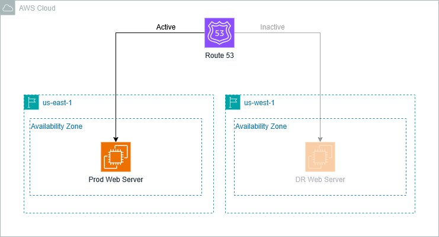

# Terraform DR Failover Example

This repository demonstrates how to implement disaster recovery (DR) failover strategies using Terraform.

## Table of Contents

- Overview
- Solution Architecture
- Prerequisites
- Getting Started
- Usage
- How It Works
- Resources

## Overview

This project showcases a disaster recovery solution implemented with Terraform that allows you to quickly switch between primary and secondary environments in case of a disaster or for testing purposes. The implementation follows industry best practices for automating DR failover processes.

## Solution Architecture



The architecture demonstrates a multi-region disaster recovery setup with:

- Primary and secondary regions
- Automated failover mechanisms
- Infrastructure as Code deployment
- State management across environments

For detailed implementation insights, refer to the [HashiCorp blog article on disaster recovery strategies](https://www.hashicorp.com/en/blog/disaster-recovery-strategies-with-terraform).

## Prerequisites

- Terraform >= 0.14.x
- AWS CLI configured (or other cloud provider as applicable)
- Basic understanding of disaster recovery concepts
- Required permissions to create and manage resources

## Getting Started

1. Clone this repository
2. Review the configuration files in the project
3. Adjust variables as needed for your environment
4. Follow the usage instructions below

## Usage

The project supports two main operations:

### Failover to DR Environment

To trigger a failover to the disaster recovery environment:

```bash
terraform apply -var="dr_switchover=true" -auto-approve
```

### Failback to Primary Environment

To switch back to the primary environment:

```bash
terraform apply -var="dr_switchover=false" -auto-approve
```

## How It Works

The `dr_switchover` variable controls which environment is active:

- When set to `true`, resources are provisioned in the DR environment
- When set to `false`, resources return to the primary environment

This implementation uses Terraform's ability to conditionally create resources based on input variables, allowing for seamless transitions between environments.

## Resources

- [HashiCorp blog: Disaster Recovery Strategies with Terraform](https://www.hashicorp.com/en/blog/disaster-recovery-strategies-with-terraform)
- Terraform Documentation: [Managing Variable Definitions](https://www.terraform.io/language/values/variables)
